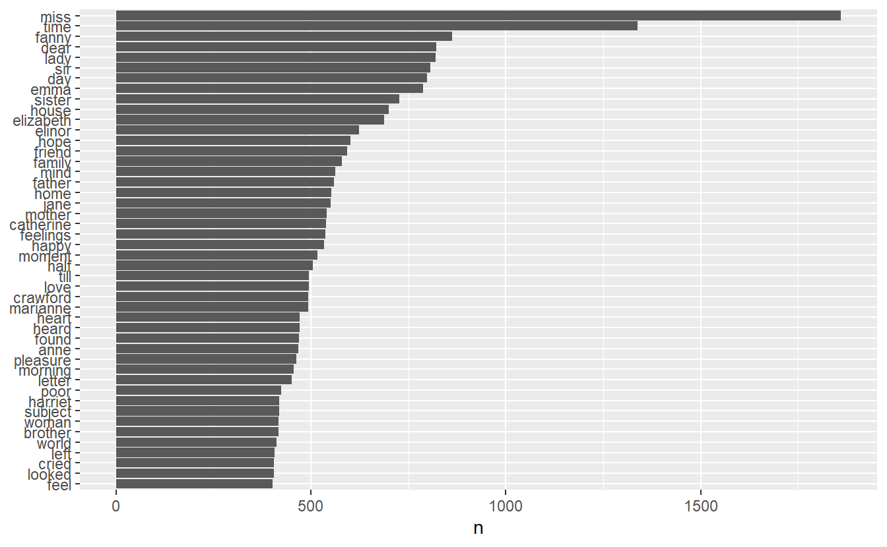
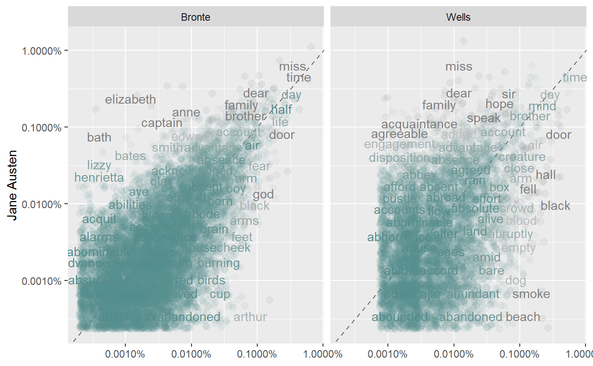
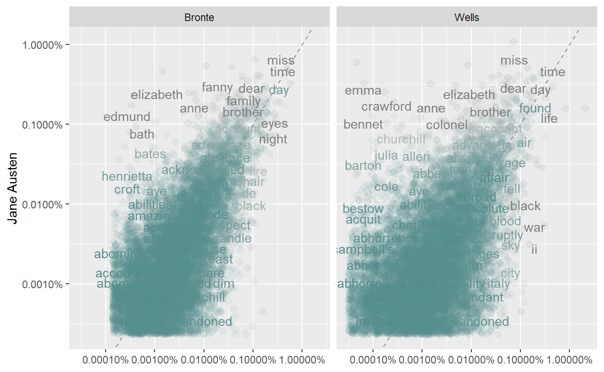

# Tidy Text Mining from STAT 413


Learning Objectives

- Remove stop words and identify frequently used words in a text
- Compare word counts between different groups of text

Resources:

[Text Mining with R by Julia Silge and David Robinson](https://www.tidytextmining.com/). 

## Tidy Text Format

This first [video](https://youtu.be/80RHkcE_TIs) corresponds to the online book sections 1.1 - 1.2 which I suggest you read first.

Tidy text format (ttf): A table with one token per row where a token is a meaningful unit of text such as a word, n-gram, sentence or paragraph.

Other text mining tools use:

* strings
* corpus: contain raw strings annotated with metadata
* document-term matrix: sparse matrix with each row containing one document and each column one term or word; entries are generally counts or td-idf (term frequency - inverse document freq)


```r
text <- c("If You Forget Me",
"by Pablo Neruda",
"I want you to know",
"one thing.",
"You know how this is:",
"if I look",
"at the crystal moon, at the red branch",
"of the slow autumn at my window,",
"if I touch",
"near the fire",
"the impalpable ash",
"or the wrinkled body of the log,",
"everything carries me to you,",
"as if everything that exists,",
"aromas, light, metals,",
"were little boats",
"that sail",
"toward those isles of yours that wait for me."
)
text
#>  [1] "If You Forget Me"                             
#>  [2] "by Pablo Neruda"                              
#>  [3] "I want you to know"                           
#>  [4] "one thing."                                   
#>  [5] "You know how this is:"                        
#>  [6] "if I look"                                    
#>  [7] "at the crystal moon, at the red branch"       
#>  [8] "of the slow autumn at my window,"             
#>  [9] "if I touch"                                   
#> [10] "near the fire"                                
#> [11] "the impalpable ash"                           
#> [12] "or the wrinkled body of the log,"             
#> [13] "everything carries me to you,"                
#> [14] "as if everything that exists,"                
#> [15] "aromas, light, metals,"                       
#> [16] "were little boats"                            
#> [17] "that sail"                                    
#> [18] "toward those isles of yours that wait for me."
text_df <- tibble(
  line = 1:length(text),
  text = text
)
text_df
#> # A tibble: 18 x 2
#>    line text                 
#>   <int> <chr>                
#> 1     1 If You Forget Me     
#> 2     2 by Pablo Neruda      
#> 3     3 I want you to know   
#> 4     4 one thing.           
#> 5     5 You know how this is:
#> 6     6 if I look            
#> # ... with 12 more rows
text_df %>%
  unnest_tokens(word, text)
#> # A tibble: 80 x 2
#>    line word  
#>   <int> <chr> 
#> 1     1 if    
#> 2     1 you   
#> 3     1 forget
#> 4     1 me    
#> 5     2 by    
#> 6     2 pablo 
#> # ... with 74 more rows
data(stop_words)
text_word_count <- text_df %>%
  unnest_tokens(word, text) %>%
  anti_join(stop_words) %>% # get rid of uninteresting words
  count(word, sort = TRUE) # count of each word left
#> Joining, by = "word"
```

--------------------------------------------

## `unnest_tokens()` on larger text

Section 1.3 in online book.  Then watch this [video](https://youtu.be/qCvyzp7JSOI) as you work through this section.

Let's look at a larger text, say all of Jane Austen's novels.


```r
orig_books <- austen_books() %>%
  group_by(book) %>%
  mutate(linenumber = row_number(),
         chapter = cumsum(str_detect(text, 
             regex("^chapter [\\divxlc]", 
                   ignore_case = TRUE)))) %>%
  ungroup() %>%
  select(chapter, linenumber, everything())
orig_books
#> # A tibble: 73,422 x 4
#>   chapter linenumber text                    book               
#>     <int>      <int> <chr>                   <fct>              
#> 1       0          1 "SENSE AND SENSIBILITY" Sense & Sensibility
#> 2       0          2 ""                      Sense & Sensibility
#> 3       0          3 "by Jane Austen"        Sense & Sensibility
#> 4       0          4 ""                      Sense & Sensibility
#> 5       0          5 "(1811)"                Sense & Sensibility
#> 6       0          6 ""                      Sense & Sensibility
#> # ... with 73,416 more rows

#  make data tidy
tidy_books <- orig_books %>%
  unnest_tokens(word, text) %>%
  # use str_extract because some gutenberg texts have other symbols around
  # the words as part of the encoding
  mutate(word = str_extract(word, "[a-z']+")) %>%
  anti_join(stop_words)
#> Joining, by = "word"

tidy_books %>%
  count(word, sort = TRUE)
#> # A tibble: 13,464 x 2
#>   word      n
#> * <chr> <int>
#> 1 miss   1860
#> 2 time   1339
#> 3 fanny   862
#> 4 dear    822
#> 5 lady    819
#> 6 sir     807
#> # ... with 13,458 more rows

# visualize
tidy_books %>%
  count(word, sort = TRUE) %>%
  filter(n > 400) %>%
  mutate(word = reorder(word,n)) %>%
  ggplot(aes(word, n)) +
    geom_col() +
    xlab(NULL) +
    coord_flip()
```



----------------------------------------------


## Compare word frequencies between authors

This section corresponds to section 1.4 in the online book. Watch this [video](https://youtu.be/qc7wuH9Dhp0) as you work through this section.

We now compare frequencies across different authors.  We will look at H.G. Wells (The Island of Doctor Moreau, The War of the Worlds, The Time Machine, and The Invisible Man) and the Bronte Sisters (Jane Eyre, Wuthering Heights, Agnes Grey, The Tenant of Wildfell Hall and Villette) since they are from a similar time-frame as Jane Austen.

First, take a few minutes to explore the [gutenberg website](http://www.gutenberg.org/).  We will search by author  and then find the book numbers we want to download.


```r
hgwells <- gutenberg_download(c(35, 36, 159, 5230))
#> Determining mirror for Project Gutenberg from http://www.gutenberg.org/robot/harvest
#> Using mirror http://aleph.gutenberg.org
#> Warning: `do()` is deprecated as of dplyr 1.0.0.
#> Use condense() or summarise()
#> This warning is displayed once every 8 hours.
#> Call `lifecycle::last_warnings()` to see where this warning was generated.
bronte <- gutenberg_download(c(767, 768, 969, 1260, 9182))
tidy_hgwells <- hgwells %>%
  unnest_tokens(word, text) %>%
  mutate(word = str_extract(word, "[a-z']+")) %>%
  anti_join(stop_words)
#> Joining, by = "word"
tidy_bronte <- bronte %>%
  unnest_tokens(word, text) %>%
  mutate(word = str_extract(word, "[a-z']+")) %>%
  anti_join(stop_words)
#> Joining, by = "word"
tidy_hgwells %>%
  count(word, sort = TRUE)
#> # A tibble: 11,648 x 2
#>   word       n
#> * <chr>  <int>
#> 1 time     454
#> 2 people   302
#> 3 door     260
#> 4 heard    249
#> 5 black    232
#> 6 stood    229
#> # ... with 11,642 more rows
tidy_bronte %>%
  count(word, sort = TRUE)
#> # A tibble: 22,516 x 2
#>   word      n
#> * <chr> <int>
#> 1 time   1065
#> 2 miss    856
#> 3 day     828
#> 4 hand    768
#> 5 eyes    713
#> 6 night   647
#> # ... with 22,510 more rows
```
Put all three authors together in one tibble with a new column showing author.

```r
frequency_by_word_across_authors <- bind_rows(mutate(tidy_bronte,
                 author = "Bronte"),
                 mutate(tidy_hgwells, author = "Wells"),
                 mutate(tidy_books, author = "Austen")) %>%
            mutate(word = str_extract(word, "[a-z']+")) %>%
            count(author, word) %>%
            group_by(author) %>%
            mutate(proportion = n / sum(n)) %>%
            select(-n) %>%
            spread(author, proportion)
frequency_by_word_across_authors
#> # A tibble: 28,678 x 4
#>   word           Austen      Bronte      Wells
#>   <chr>           <dbl>       <dbl>      <dbl>
#> 1 a'most    NA           0.0000160  NA        
#> 2 a'n't      0.00000462 NA          NA        
#> 3 aback     NA           0.00000400  0.0000150
#> 4 abaht     NA           0.00000400 NA        
#> 5 abandon   NA           0.0000320   0.0000150
#> 6 abandoned  0.00000462  0.0000920   0.000180 
#> # ... with 28,672 more rows
frequency <- frequency_by_word_across_authors %>%
            gather(author, proportion, `Bronte`:`Wells`)
frequency
#> # A tibble: 57,356 x 4
#>   word           Austen author  proportion
#>   <chr>           <dbl> <chr>        <dbl>
#> 1 a'most    NA          Bronte  0.0000160 
#> 2 a'n't      0.00000462 Bronte NA         
#> 3 aback     NA          Bronte  0.00000400
#> 4 abaht     NA          Bronte  0.00000400
#> 5 abandon   NA          Bronte  0.0000320 
#> 6 abandoned  0.00000462 Bronte  0.0000920 
#> # ... with 57,350 more rows
```

------------------------------------

## Compare word frequency by author to Austen

Book sections 1.5 - 1.6 and this [video](https://youtu.be/vvmoHPM1Yf0)

Now let's graph the frequency comparison of each other author to Jane Austen.  

```r
frequency %>% ggplot(aes(x = proportion, 
          y = `Austen`, 
          color = abs(`Austen` - proportion))) +
  geom_abline(color = "gray40", lty = 2) +
  geom_jitter(alpha = 0.1, size = 2.5, 
              width = 0.3, height = 0.3) +
  geom_text(aes(label = word), 
            check_overlap = TRUE, vjust = 1.5) +
  scale_x_log10(labels = percent_format()) +
  scale_y_log10(labels = percent_format()) +
  scale_color_gradient(limits = c(0, 0.001), 
                       low = "darkslategray4",
                       high = "gray75") +
  facet_wrap(~author, ncol = 2) +
  theme(legend.position="none") +
  labs(y = "Jane Austen", x = NULL)
#> Warning: Removed 41043 rows containing missing values (geom_point).
#> Warning: Removed 41045 rows containing missing values (geom_text).
```


We can tell that Austen and Bronte are more similar (grouped closer to the line) than Austen and Wells.  Let's use a correlation test to quantify the amounts.

```r
df_Bronte <- frequency[frequency$author == "Bronte",]
df_Bronte
#> # A tibble: 28,678 x 4
#>   word           Austen author  proportion
#>   <chr>           <dbl> <chr>        <dbl>
#> 1 a'most    NA          Bronte  0.0000160 
#> 2 a'n't      0.00000462 Bronte NA         
#> 3 aback     NA          Bronte  0.00000400
#> 4 abaht     NA          Bronte  0.00000400
#> 5 abandon   NA          Bronte  0.0000320 
#> 6 abandoned  0.00000462 Bronte  0.0000920 
#> # ... with 28,672 more rows
cor.test(data = df_Bronte,  ~ proportion + `Austen`)
#> 
#> 	Pearson's product-moment correlation
#> 
#> data:  proportion and Austen
#> t = 119, df = 10299, p-value <2e-16
#> alternative hypothesis: true correlation is not equal to 0
#> 95 percent confidence interval:
#>  0.753 0.769
#> sample estimates:
#>   cor 
#> 0.761
df_Wells <- frequency[frequency$author == "Wells",]
df_Wells
#> # A tibble: 28,678 x 4
#>   word           Austen author proportion
#>   <chr>           <dbl> <chr>       <dbl>
#> 1 a'most    NA          Wells  NA        
#> 2 a'n't      0.00000462 Wells  NA        
#> 3 aback     NA          Wells   0.0000150
#> 4 abaht     NA          Wells  NA        
#> 5 abandon   NA          Wells   0.0000150
#> 6 abandoned  0.00000462 Wells   0.000180 
#> # ... with 28,672 more rows
cor.test(data = df_Wells,  ~ proportion + `Austen`)
#> 
#> 	Pearson's product-moment correlation
#> 
#> data:  proportion and Austen
#> t = 36, df = 6010, p-value <2e-16
#> alternative hypothesis: true correlation is not equal to 0
#> 95 percent confidence interval:
#>  0.403 0.445
#> sample estimates:
#>   cor 
#> 0.424
```
- **Exercise 1:**  Repeat the above analysis using all the H.G. Wells and Bronte works that are available on gutenberg.org

You will need to use gutenberg_works(author == "Wells, H. G. (Herbert George)") to get started. We figured this out by looking at any H.G. Wells book on the gutenberg.org website and then looking at the Bibiliography Record to see how the author is listed there. Similarly, find the Bronte works.

- **Exercise 2:** Pick three other authors from Gutenberg.org and download their works. Compare the authors.  Which two are more alike?  Some suggestions if you can't think of any:  Mark Twain, Leo Tolstoy, Charles Dickens.


```
#> Warning: `filter_()` is deprecated as of dplyr 0.7.0.
#> Please use `filter()` instead.
#> See vignette('programming') for more help
#> This warning is displayed once every 8 hours.
#> Call `lifecycle::last_warnings()` to see where this warning was generated.
#> Warning: `distinct_()` is deprecated as of dplyr 0.7.0.
#> Please use `distinct()` instead.
#> See vignette('programming') for more help
#> This warning is displayed once every 8 hours.
#> Call `lifecycle::last_warnings()` to see where this warning was generated.
#> Joining, by = "word"
#> Joining, by = "word"
#> # A tibble: 61,913 x 4
#>   word      Austen Bronte       Wells
#>   <chr>      <dbl>  <dbl>       <dbl>
#> 1 '             NA     NA 0.00000126 
#> 2 a'ch          NA     NA 0.000000628
#> 3 a'chitect     NA     NA 0.00000126 
#> 4 a'eplane      NA     NA 0.000000628
#> 5 a'hm          NA     NA 0.000000628
#> 6 a'll          NA     NA 0.00000188 
#> # ... with 61,907 more rows
#> # A tibble: 123,826 x 4
#>   word      Austen author proportion
#>   <chr>      <dbl> <chr>       <dbl>
#> 1 '             NA Bronte         NA
#> 2 a'ch          NA Bronte         NA
#> 3 a'chitect     NA Bronte         NA
#> 4 a'eplane      NA Bronte         NA
#> 5 a'hm          NA Bronte         NA
#> 6 a'll          NA Bronte         NA
#> # ... with 123,820 more rows
#> Warning: Removed 101057 rows containing missing values (geom_point).
#> Warning: Removed 101059 rows containing missing values (geom_text).
#> # A tibble: 61,913 x 4
#>   word      Austen author proportion
#>   <chr>      <dbl> <chr>       <dbl>
#> 1 '             NA Bronte         NA
#> 2 a'ch          NA Bronte         NA
#> 3 a'chitect     NA Bronte         NA
#> 4 a'eplane      NA Bronte         NA
#> 5 a'hm          NA Bronte         NA
#> 6 a'll          NA Bronte         NA
#> # ... with 61,907 more rows
#> 
#> 	Pearson's product-moment correlation
#> 
#> data:  proportion and Austen
#> t = 119, df = 10914, p-value <2e-16
#> alternative hypothesis: true correlation is not equal to 0
#> 95 percent confidence interval:
#>  0.742 0.758
#> sample estimates:
#>  cor 
#> 0.75
#> # A tibble: 61,913 x 4
#>   word      Austen author  proportion
#>   <chr>      <dbl> <chr>        <dbl>
#> 1 '             NA Wells  0.00000126 
#> 2 a'ch          NA Wells  0.000000628
#> 3 a'chitect     NA Wells  0.00000126 
#> 4 a'eplane      NA Wells  0.000000628
#> 5 a'hm          NA Wells  0.000000628
#> 6 a'll          NA Wells  0.00000188 
#> # ... with 61,907 more rows
#> 
#> 	Pearson's product-moment correlation
#> 
#> data:  proportion and Austen
#> t = 45, df = 11851, p-value <2e-16
#> alternative hypothesis: true correlation is not equal to 0
#> 95 percent confidence interval:
#>  0.365 0.396
#> sample estimates:
#>   cor 
#> 0.381
```


 

