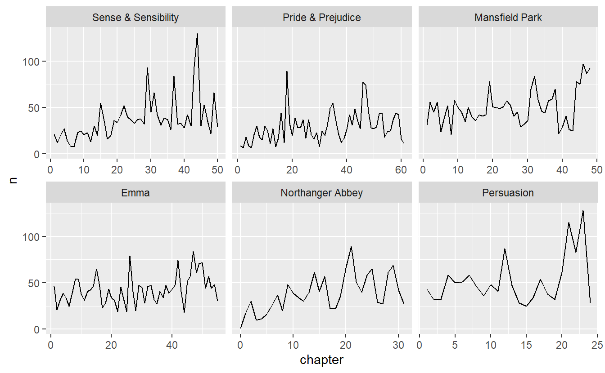
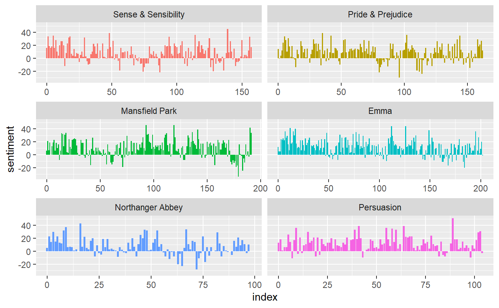
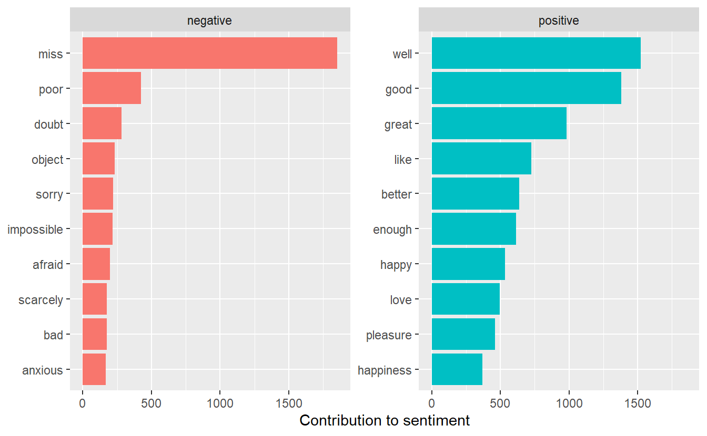
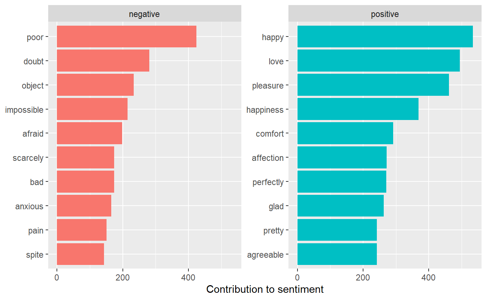
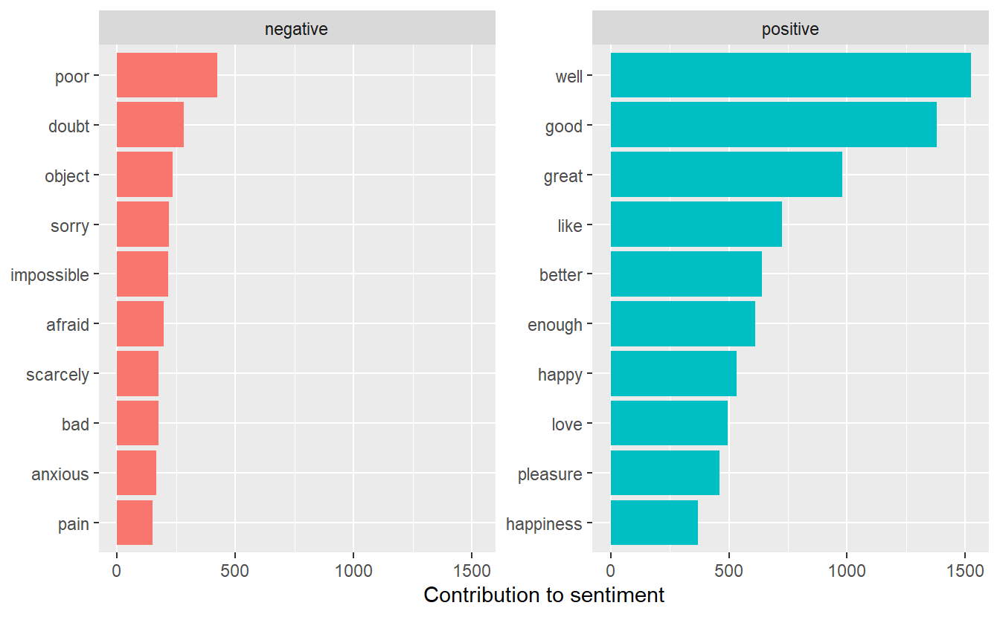
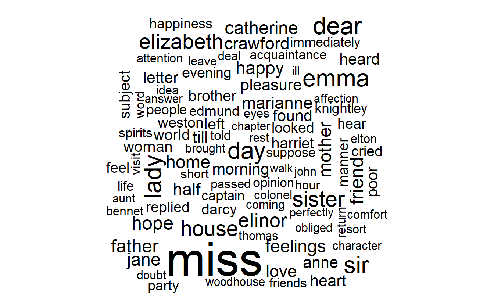
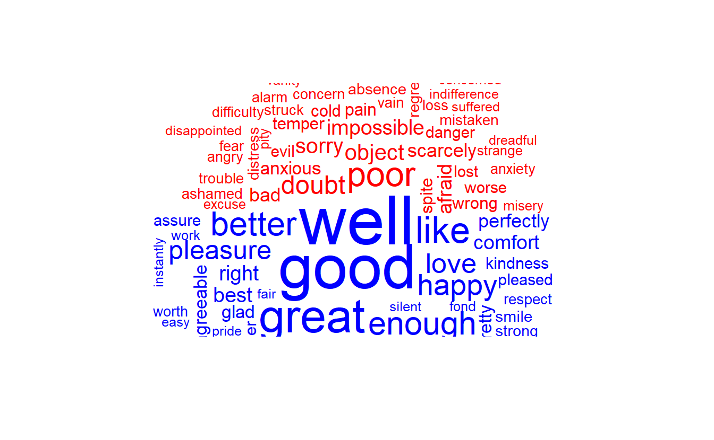

# Tidy text mining from STAT 413 continued


Learning Objectives:

- Analyze sentiment as it changes through a text
- Graph word clouds

Resources:

[Text Mining with R by Julia Silge and David Robinson](https://www.tidytextmining.com/). 

## Sentiment Analysis

Sections 2.1 - 2.3 in the book and this [video](https://youtu.be/uqiAuUcMuqU)

Naive approach:  sentiment of each word and add them up for a given amount of text. This approach does not take into account word qualifiers like not, never, always, etc.  Generally, if we add up over many paragraphs, the positive and negative words will cancel each other out.  So, we are usually better off adding either by sentence or by paragraph.

There are several sentiment lexicons we can use:  

* AFINN from Finn ?rup Nielsen,
* bing from Bing Liu and collaborators
* nrc from Saif Mohammad and Peter Turney


```r
sentiments
#> # A tibble: 6,786 x 2
#>   word       sentiment
#>   <chr>      <chr>    
#> 1 2-faces    negative 
#> 2 abnormal   negative 
#> 3 abolish    negative 
#> 4 abominable negative 
#> 5 abominably negative 
#> 6 abominate  negative 
#> # ... with 6,780 more rows
sentiments %>% arrange(word)
#> # A tibble: 6,786 x 2
#>   word       sentiment
#>   <chr>      <chr>    
#> 1 2-faces    negative 
#> 2 abnormal   negative 
#> 3 abolish    negative 
#> 4 abominable negative 
#> 5 abominably negative 
#> 6 abominate  negative 
#> # ... with 6,780 more rows
get_sentiments("afinn")
#> # A tibble: 2,477 x 2
#>   word       value
#>   <chr>      <dbl>
#> 1 abandon       -2
#> 2 abandoned     -2
#> 3 abandons      -2
#> 4 abducted      -2
#> 5 abduction     -2
#> 6 abductions    -2
#> # ... with 2,471 more rows
get_sentiments("bing")
#> # A tibble: 6,786 x 2
#>   word       sentiment
#>   <chr>      <chr>    
#> 1 2-faces    negative 
#> 2 abnormal   negative 
#> 3 abolish    negative 
#> 4 abominable negative 
#> 5 abominably negative 
#> 6 abominate  negative 
#> # ... with 6,780 more rows
get_sentiments("nrc")
#> # A tibble: 13,901 x 2
#>   word      sentiment
#>   <chr>     <chr>    
#> 1 abacus    trust    
#> 2 abandon   fear     
#> 3 abandon   negative 
#> 4 abandon   sadness  
#> 5 abandoned anger    
#> 6 abandoned fear     
#> # ... with 13,895 more rows
```

Since the nrc lexicon gives us the emotion, we can look at words labelled as fear if we choose.

```r
tidy_books <- austen_books() %>%
  group_by(book) %>%
  mutate(linenumber = row_number(),
         chapter = cumsum(str_detect(text, 
                    regex("^chapter [\\divxlc]",
                   ignore_case = TRUE)))) %>%
  ungroup() %>%
  # use word so the inner_join will match with the nrc lexicon
  unnest_tokens(word, text) 

# select only the words from the nrc lexicon that are "fear" words
nrcfear <- get_sentiments("nrc") %>%
  filter(sentiment == "fear")

tidy_books %>%
  filter(book == "Emma") %>%
  inner_join(nrcfear) %>%
  count(word, sort = TRUE)
#> # A tibble: 364 x 2
#>   word       n
#> * <chr>  <int>
#> 1 doubt     98
#> 2 ill       72
#> 3 afraid    65
#> 4 marry     63
#> 5 change    61
#> 6 bad       60
#> # ... with 358 more rows
```

---------------------------------------------------------------------

## Plot a sentiment by chapter

Watch this [video](https://youtu.be/ngoO4YzJVnY)

See if you can plot the fear by chapter.

```r
fear_chapter <- tidy_books %>% 
 inner_join(nrcfear) %>%
 group_by(book,chapter) %>%
 count()
fear_chapter %>%
  ggplot(aes(chapter, n)) +
  geom_line() + 
  facet_wrap(~book, scales = "free_x")
```



What other sentiments are there in nrc that we could look at?

```r
get_sentiments("nrc") %>%
  group_by(sentiment) %>%
  count()
#> # A tibble: 10 x 2
#> # Groups:   sentiment [10]
#>   sentiment        n
#>   <chr>        <int>
#> 1 anger         1247
#> 2 anticipation   839
#> 3 disgust       1058
#> 4 fear          1476
#> 5 joy            689
#> 6 negative      3324
#> # ... with 4 more rows
```

Now, let's use 80 line blocks and use bing to categorize each word as positive or negative.  We will spread them to get the counts in separate columns and then add a column with the net = positive - negative


```r
janeaustensentiment <- tidy_books %>%
  inner_join(get_sentiments("bing")) %>%
  count(book, index = linenumber %/% 80, sentiment) %>%
  spread(sentiment, n, fill = 0) %>%
  mutate(sentiment = positive - negative)

janeaustensentiment %>%
  ggplot(aes(index, sentiment, fill = book)) +
  geom_col(show.legend = FALSE) +
  facet_wrap(~book, ncol = 2, scales = "free_x")
```



------------------------------------------------------------------

## Modifying what contributes to sentiment analysis

Section 2.4 in online book and this[video](https://youtu.be/07NXa5L9K_4)

We should probably look at which words contribute to the positive and negative sentiment and be sure we want to include them.


```r
bing_word_counts <- tidy_books %>%
  inner_join(get_sentiments("bing")) %>%
  count(word, sentiment, sort = TRUE) %>%
  ungroup()

bing_word_counts
#> # A tibble: 2,585 x 3
#>   word   sentiment     n
#> * <chr>  <chr>     <int>
#> 1 miss   negative   1855
#> 2 well   positive   1523
#> 3 good   positive   1380
#> 4 great  positive    981
#> 5 like   positive    725
#> 6 better positive    639
#> # ... with 2,579 more rows
# visualize it
bing_word_counts %>%
  group_by(sentiment) %>%
  top_n(10) %>%
  ungroup() %>%
  mutate(word = reorder(word, n)) %>%
  ggplot(aes(word, n, fill = sentiment)) +
  geom_col(show.legend = FALSE) +
  facet_wrap(~sentiment, scales = "free_y") +
  labs(y = "Contribution to sentiment",
       x = NULL) +
  coord_flip()
```




Not what we want for Jane Austen novels!!  Miss is probably not a negative word, but rather refers to a young girl.  Two approaches to fix this:  

- take the word miss out of the data before doing the analysis or 
- change the sentiment lexicon to no longer have "miss" as a negative

First we will remove the word *miss* by adding it to the stop words.

```r
custom_stop_words <- bind_rows(data_frame(
      word = c("miss"),
      lexicon = c("custom")), 
       stop_words)

custom_stop_words
#> # A tibble: 1,150 x 2
#>   word  lexicon
#> * <chr> <chr>  
#> 1 miss  custom 
#> 2 a     SMART  
#> 3 a's   SMART  
#> 4 able  SMART  
#> 5 about SMART  
#> 6 above SMART  
#> # ... with 1,144 more rows
# Now, let's redo with the new stop words.
tidy_books_no_miss <- austen_books() %>%
  group_by(book) %>%
  mutate(linenumber = row_number(),
         chapter = cumsum(str_detect(text, 
                    regex("^chapter [\\divxlc]",
                   ignore_case = TRUE)))) %>%
  ungroup() %>%
  # use word so the inner_join will match with the nrc lexicon
  unnest_tokens(word, text) %>%
  anti_join(custom_stop_words) 

bing_word_counts <- tidy_books_no_miss %>%
  inner_join(get_sentiments("bing")) %>%
  count(word, sentiment, sort = TRUE) %>%
  ungroup()

bing_word_counts
#> # A tibble: 2,554 x 3
#>   word      sentiment     n
#> * <chr>     <chr>     <int>
#> 1 happy     positive    534
#> 2 love      positive    495
#> 3 pleasure  positive    462
#> 4 poor      negative    424
#> 5 happiness positive    369
#> 6 comfort   positive    292
#> # ... with 2,548 more rows

bing_word_counts %>%
  group_by(sentiment) %>%
  top_n(10) %>%
  ungroup() %>%
  mutate(word = reorder(word, n)) %>%
  ggplot(aes(word, n, fill = sentiment)) +
  geom_col(show.legend = FALSE) +
  facet_wrap(~sentiment, scales = "free_y") +
  labs(y = "Contribution to sentiment",
       x = NULL) +
  coord_flip()
```



A different approach would be to leave it in the analysis, but remove the word "miss" from the bing sentiment lexicon.


```r
bing_no_miss <- get_sentiments("bing") %>%
  filter(word != "miss")
bing_word_counts <- tidy_books %>%
  inner_join(bing_no_miss) %>%
  count(word, sentiment, sort = TRUE) %>%
  ungroup()

bing_word_counts
#> # A tibble: 2,584 x 3
#>   word   sentiment     n
#> * <chr>  <chr>     <int>
#> 1 well   positive   1523
#> 2 good   positive   1380
#> 3 great  positive    981
#> 4 like   positive    725
#> 5 better positive    639
#> 6 enough positive    613
#> # ... with 2,578 more rows
# visualize it
bing_word_counts %>%
  group_by(sentiment) %>%
  top_n(10) %>%
  ungroup() %>%
  mutate(word = reorder(word, n)) %>%
  ggplot(aes(word, n, fill = sentiment)) +
  geom_col(show.legend = FALSE) +
  facet_wrap(~sentiment, scales = "free_y") +
  labs(y = "Contribution to sentiment",
       x = NULL) +
  coord_flip()
```



- **Exercise 3:** Let’s look at how the sentiment changes across the length of a book by looking at 80 lines at a time.  Compare how sentiment changes in Victor Hugo’s Les Miserables and Charles Dickens’ A Tale of Two Cities.  Look at negative vs positive sentiment.  Then pick a sentiment like joy or anger or fear or …  and see how that sentiment compares.

-------------------------------------------------

## WordCloud plots

Sections 2.5 - 2.7 in book and this [video](https://youtu.be/dUGa7YVm8yU)

We can do wordcloud plots where the frequency of the word in the text determines the size of the word in the wordcloud.  We can also color the words based on the sentiment.


```r
library(wordcloud)
tidy_books %>%
  anti_join(stop_words) %>%
  count(word) %>%
  with(wordcloud(word, n, max.words = 100))

library(reshape2)

tidy_books %>%
  inner_join(bing_no_miss) %>%
  count(word, sentiment, sort = TRUE) %>%
  acast(word ~ sentiment, value.var = "n", fill = 0) %>%
  comparison.cloud(colors = c("red", "blue"),
                   max.words = 100)
```


